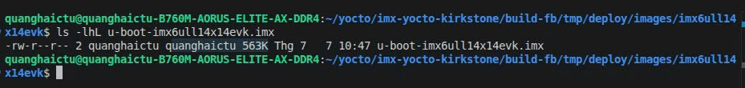
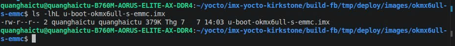

# Tối ưu size image và boot time

Theo boot flow, để giảm dung lượng image và rút ngắn boot time cần tối ưu 3 phần chính:

1. Tối ưu U-Boot
2. Tối ưu kernel
3. Tối ưu rootfs

## 1. Tối ưu U-Boot

Theo boot flow, U-Boot là thành phần được chạy đầu tiên sau khi Boot ROM khởi tạo được eMMC và đọc vùng boot ban đầu. Có thể xem thêm tài liệu boot flow tại:

```text
/home/quanghaictu/WORK/DOC_FOR_IMX6ULL_X/IMX6ULL_doccument/My_doc/NXP_IMX6ULL_EVK/MARKDOWN_DOC_NXP/i.MX_6ULL_Applications_Processor_Reference_Manual/Chapter_8_System_Boot.md
```

### 1.1. Giảm size U-Boot

Để tiết kiệm dung lượng eMMC, khi build em đã tắt một số chức năng không cần thiết để file `u-boot.imx` nhỏ nhất có thể, chỉ giữ lại các tính năng hữu ích cho debug và vận hành.

Có thể xem cấu hình U-Boot đang bật/tắt tại:

```text
/home/quanghaictu/yocto/imx-yocto-kirkstone/meta-okmx6ull/recipes-bsp/u-boot/files/okmx6ull_s_emmc_defconfig
```

Bảng giải thích các chức năng đã tắt, lý do tắt và lợi ích mang lại:

```text
https://1drv.ms/x/c/E90C81AC76767422/IQCql6jvnra5R734uUIjbfc6ARPCVJSzPIGtPtQPG13nDoY?e=LSzzWJ
```

Trước khi tối ưu, file U-Boot mặc định của hãng có dung lượng khoảng `563 KB`. Sau khi tắt các cấu hình không dùng đến, dung lượng giảm còn khoảng `379 KB`.

#### Trước khi tối ưu



#### Sau khi tối ưu



### 1.2. Giảm boot time U-Boot

Ngoài tối ưu size, em cũng tối ưu boot time của U-Boot.

Đầu tiên, em tắt thời gian chờ boot bằng cách đổi:

```text
CONFIG_BOOTDELAY=3
```

thành:

```text
CONFIG_BOOTDELAY=0
```

Thay đổi này giúp giảm khoảng `3 giây` trong quá trình boot.

Tiếp theo, em chỉnh lại boot command.

Boot command ban đầu:

```text
CONFIG_BOOTCOMMAND="ledblink 3 100;run findfdt;mmc dev ${mmcdev};mmc dev ${mmcdev}; if mmc rescan; then if run loadbootscript; then run bootscript; else if run loadimage; then run mmcboot; else run netboot; fi; fi; else run netboot; fi"
```

Vấn đề của boot command ban đầu:

- Chạy app `ledblink` trong U-Boot nên mất thêm thời gian khởi tạo và thực thi.
- Gọi `mmc dev ${mmcdev}` lặp lại 2 lần.
- Không chỉ định cụ thể eMMC, nên U-Boot có thể mất thêm thời gian scan/tìm thiết bị boot.
- Có fallback sang `netboot`, làm luồng boot dài hơn trong trường hợp chỉ boot từ eMMC.

Boot command sau khi tối ưu:

```text
CONFIG_BOOTCOMMAND="run findfdt; mmc dev 1; if mmc rescan; then if run loadbootscript; then run bootscript; else if run loadimage; then run mmcboot; fi; fi; fi"
```

Sau khi tối ưu, U-Boot đi thẳng vào eMMC bằng `mmc dev 1`, bỏ bớt các bước không cần thiết, từ đó giảm thời gian boot.

#### Trước khi sửa boot command


#### Sau khi sửa boot command


## 2. Tối ưu kernel

Sau khi U-Boot đọc DCD, khởi tạo SDRAM và load được `zImage` cùng `dtb` vào RAM, kernel bắt đầu chạy. Ở phần này, em tối ưu theo hai hướng:

1. Tắt các kernel config không dùng đến.
2. Disable các node Device Tree không dùng trong dự án.

### 2.1. Tắt kernel config không dùng

Các kernel config Wi-Fi/Bluetooth/network không dùng được tắt tại:

```text
/home/quanghaictu/yocto/imx-yocto-kirkstone/meta-okmx6ull/recipes-kernel/linux/linux-imx/wifi.cfg
```

Bảng giải thích lý do tắt và ý nghĩa của từng config:

```text
https://1drv.ms/x/c/E90C81AC76767422/IQCql6jvnra5R734uUIjbfc6ARPCVJSzPIGtPtQPG13nDoY?e=LSzzWJ
```

Chủ yếu phần này tắt các driver/config không dùng khi build kernel, giúp file `zImage` nhẹ hơn. Ví dụ:

- Tắt Bluetooth vì board chỉ dùng Wi-Fi.
- Tắt driver Wi-Fi vendor/mainline không dùng từ Yocto.
- Chỉ dùng driver RTL8723DU được port từ source SDK Forlinx.

Source driver RTL8723DU được port vào Yocto tại:

```text
/home/quanghaictu/yocto/imx-yocto-kirkstone/meta-okmx6ull/recipes-kernel/rtl8723du
```

### 2.2. Disable node Device Tree không dùng

Em disable các node không dùng trong dự án để giảm thời gian kernel khởi tạo ngoại vi không cần thiết.

Có thể xem các node đã tắt tại:

```text
/home/quanghaictu/yocto/imx-yocto-kirkstone/meta-okmx6ull/recipes-kernel/linux/linux-imx/imx6ull-14x14-evk-emmc.dts
```

Bảng giải thích lý do tắt và ý nghĩa của từng node nằm ở tab `kernel`:

```text
https://1drv.ms/x/c/E90C81AC76767422/IQCql6jvnra5R734uUIjbfc6ARPCVJSzPIGtPtQPG13nDoY?e=LSzzWJ
```

Sau khi tối ưu Device Tree, kernel không probe các ngoại vi không dùng, giúp boot log gọn hơn và giảm thời gian khởi tạo phần cứng.

Sau khi tắt bớt khởi tạo các ngoại vi không cần thiết trong Device Tree, boot time kernel đã có cải tiến.

#### Trước khi tối ưu kernel


#### Sau khi tối ưu kernel


### 2.3. Luồng kernel probe thiết bị từ Device Tree

Sau khi U-Boot load `zImage` và `dtb` vào RAM, kernel không đọc file `.dts` nữa. Lúc này kernel dùng cây Device Tree đã được bung từ `.dtb` trong RAM, sau đó scan các node để tạo `platform_device` và gọi driver tương ứng.

Flow tổng quát:

```text
DTS node trong DTB
 -> of_platform_default_populate_init()
 -> of_platform_default_populate()
 -> of_platform_populate()
 -> of_platform_bus_create()
 -> of_platform_device_create_pdata()
 -> tạo platform_device từ node DTS
 -> platform_match()
 -> of_driver_match_device()
 -> platform_probe()
 -> driver .probe()
```

#### 2.3.1. `of_platform_default_populate_init()`

Hàm này là điểm kernel bắt đầu populate device từ Device Tree. Nó kiểm tra kernel đã có DTB chưa, populate riêng node `/firmware` nếu có, sau đó scan phần còn lại của cây Device Tree.

Path:

```text
/home/quanghaictu/yocto/imx-yocto-kirkstone/build-fb/tmp/work-shared/okmx6ull-s-emmc/kernel-source/drivers/of/platform.c:517
```

Code chính:

```c
static int __init of_platform_default_populate_init(void)
{
    struct device_node *node;

    device_links_supplier_sync_state_pause();

    if (!of_have_populated_dt())
        return -ENODEV;

    node = of_find_node_by_path("/firmware");
    if (node) {
        of_platform_populate(node, NULL, NULL, NULL);
        of_node_put(node);
    }

    /* Populate everything else. */
    of_platform_default_populate(NULL, NULL, NULL);

    return 0;
}
arch_initcall_sync(of_platform_default_populate_init);
```

#### 2.3.2. `of_platform_default_populate()`

Hàm này là wrapper gọi sang `of_platform_populate()` với bảng match bus mặc định `of_default_bus_match_table`. Nhờ bảng này kernel biết các node kiểu `simple-bus` cần được scan tiếp các node con bên trong.

Path:

```text
/home/quanghaictu/yocto/imx-yocto-kirkstone/build-fb/tmp/work-shared/okmx6ull-s-emmc/kernel-source/drivers/of/platform.c:499
```

Code chính:

```c
int of_platform_default_populate(struct device_node *root,
                 const struct of_dev_auxdata *lookup,
                 struct device *parent)
{
    return of_platform_populate(root, of_default_bus_match_table, lookup,
                    parent);
}
```

#### 2.3.3. `of_platform_populate()`

Hàm này lấy node bắt đầu scan. Nếu `root == NULL` thì lấy node gốc `/`. Sau đó nó duyệt từng node con và gọi `of_platform_bus_create()` để tạo device.

Path:

```text
/home/quanghaictu/yocto/imx-yocto-kirkstone/build-fb/tmp/work-shared/okmx6ull-s-emmc/kernel-source/drivers/of/platform.c:467
```

Code chính:

```c
int of_platform_populate(struct device_node *root,
             const struct of_device_id *matches,
             const struct of_dev_auxdata *lookup,
             struct device *parent)
{
    struct device_node *child;
    int rc = 0;

    root = root ? of_node_get(root) : of_find_node_by_path("/");
    if (!root)
        return -EINVAL;

    for_each_child_of_node(root, child) {
        rc = of_platform_bus_create(child, matches, lookup, parent, true);
        if (rc) {
            of_node_put(child);
            break;
        }
    }

    of_node_set_flag(root, OF_POPULATED_BUS);
    of_node_put(root);
    return rc;
}
```

#### 2.3.4. `of_platform_bus_create()`

Hàm này xử lý từng node Device Tree. Nếu node không có `compatible` thì bỏ qua. Nếu node hợp lệ thì gọi `of_platform_device_create_pdata()` để tạo `platform_device`. Nếu node đó là bus, ví dụ `simple-bus`, nó tiếp tục scan các node con.

Path:

```text
/home/quanghaictu/yocto/imx-yocto-kirkstone/build-fb/tmp/work-shared/okmx6ull-s-emmc/kernel-source/drivers/of/platform.c:345
```

Code chính:

```c
static int of_platform_bus_create(struct device_node *bus,
                  const struct of_device_id *matches,
                  const struct of_dev_auxdata *lookup,
                  struct device *parent, bool strict)
{
    struct device_node *child;
    struct platform_device *dev;

    if (strict && (!of_get_property(bus, "compatible", NULL)))
        return 0;

    dev = of_platform_device_create_pdata(bus, bus_id, platform_data, parent);
    if (!dev || !of_match_node(matches, bus))
        return 0;

    for_each_child_of_node(bus, child)
        of_platform_bus_create(child, matches, lookup, &dev->dev, strict);
}
```

Ví dụ với node `/soc`:

```text
/soc
 -> tạo platform_device cho soc
 -> thấy soc là simple-bus
 -> scan tiếp node con:
      /soc/ethernet@2188000
      /soc/usdhc@219c000
      /soc/uart@2020000
```

#### 2.3.5. `of_platform_device_create_pdata()`

Đây là chỗ quan trọng khi tối ưu Device Tree. Hàm này kiểm tra node có được enable không. Nếu node có `status = "disabled"` thì `of_device_is_available()` trả false và kernel không tạo device, nên driver không bị probe.

Path:

```text
/home/quanghaictu/yocto/imx-yocto-kirkstone/build-fb/tmp/work-shared/okmx6ull-s-emmc/kernel-source/drivers/of/platform.c:165
```

Code chính:

```c
static struct platform_device *of_platform_device_create_pdata(
                    struct device_node *np,
                    const char *bus_id,
                    void *platform_data,
                    struct device *parent)
{
    struct platform_device *dev;

    if (!of_device_is_available(np) ||
        of_node_test_and_set_flag(np, OF_POPULATED))
        return NULL;

    dev = of_device_alloc(np, bus_id, parent);
    if (!dev)
        goto err_clear_flag;

    dev->dev.bus = &platform_bus_type;
    dev->dev.platform_data = platform_data;

    if (of_device_add(dev) != 0) {
        platform_device_put(dev);
        goto err_clear_flag;
    }

    return dev;
}
```

Ý nghĩa với DTS:

```dts
&fec1 {
    status = "disabled";
};
```

Node này sẽ bị bỏ qua ngay ở `of_device_is_available()`, vì vậy kernel không tạo `platform_device` cho `fec1`.

#### 2.3.6. `platform_match()`

Sau khi `platform_device` được tạo, platform bus sẽ tìm driver phù hợp. Với thiết bị sinh ra từ Device Tree, kernel ưu tiên match bằng `compatible`.

Path:

```text
/home/quanghaictu/yocto/imx-yocto-kirkstone/build-fb/tmp/work-shared/okmx6ull-s-emmc/kernel-source/drivers/base/platform.c:1342
```

Code chính:

```c
static int platform_match(struct device *dev, struct device_driver *drv)
{
    if (of_driver_match_device(dev, drv))
        return 1;

    if (acpi_driver_match_device(dev, drv))
        return 1;

    if (pdrv->id_table)
        return platform_match_id(pdrv->id_table, pdev) != NULL;

    return (strcmp(pdev->name, drv->name) == 0);
}
```

#### 2.3.7. `of_driver_match_device()`

Hàm này so sánh `compatible` của node DTS với `of_match_table` trong driver.

Path:

```text
/home/quanghaictu/yocto/imx-yocto-kirkstone/build-fb/tmp/work-shared/okmx6ull-s-emmc/kernel-source/include/linux/of_device.h:23
```

Code chính:

```c
static inline int of_driver_match_device(struct device *dev,
                     const struct device_driver *drv)
{
    return of_match_device(drv->of_match_table, dev) != NULL;
}
```

Ví dụ driver FEC khai báo bảng match tại:

```text
/home/quanghaictu/yocto/imx-yocto-kirkstone/build-fb/tmp/work-shared/okmx6ull-s-emmc/kernel-source/drivers/net/ethernet/freescale/fec_main.c:222
```

```c
static const struct of_device_id fec_dt_ids[] = {
    { .compatible = "fsl,imx6ul-fec", .data = &fec_devtype[IMX6UL_FEC], },
    { /* sentinel */ }
};
```

#### 2.3.8. `platform_probe()`

Khi device và driver match nhau, platform bus gọi hàm `.probe` của driver.

Path:

```text
/home/quanghaictu/yocto/imx-yocto-kirkstone/build-fb/tmp/work-shared/okmx6ull-s-emmc/kernel-source/drivers/base/platform.c:1386
```

Code chính:

```c
static int platform_probe(struct device *_dev)
{
    struct platform_driver *drv = to_platform_driver(_dev->driver);
    struct platform_device *dev = to_platform_device(_dev);

    if (drv->probe)
        ret = drv->probe(dev);
}
```

#### 2.3.9. Driver `.probe()`

Mỗi driver platform sẽ khai báo `.of_match_table` và `.probe`. Ví dụ driver Ethernet FEC:

Path:

```text
/home/quanghaictu/yocto/imx-yocto-kirkstone/build-fb/tmp/work-shared/okmx6ull-s-emmc/kernel-source/drivers/net/ethernet/freescale/fec_main.c:4290
```

```c
static struct platform_driver fec_driver = {
    .driver = {
        .name = DRIVER_NAME,
        .of_match_table = fec_dt_ids,
    },
    .probe = fec_probe,
    .remove = fec_drv_remove,
};
```

Hàm probe thật:

```text
/home/quanghaictu/yocto/imx-yocto-kirkstone/build-fb/tmp/work-shared/okmx6ull-s-emmc/kernel-source/drivers/net/ethernet/freescale/fec_main.c:3835
```

```c
fec_probe(struct platform_device *pdev)
{
    struct device_node *np = pdev->dev.of_node;

    of_id = of_match_device(fec_dt_ids, &pdev->dev);
    ...
}
```

Kết luận: disable node trong DTS không trực tiếp xóa driver khỏi kernel, nhưng nó làm kernel không tạo `platform_device` cho node đó. Không có device thì không match driver, không gọi `.probe`, từ đó giảm thời gian khởi tạo ngoại vi không dùng.

## 3. Tối ưu rootfs

Ở phần rootfs, em tối ưu theo hai hướng chính:

1. Tắt các thành phần BusyBox không dùng để giảm size rootfs.
2. Tối ưu các thành phần khởi động trong rootfs để giảm boot time.

### 3.1. Giảm size rootfs

Em tắt bớt các applet BusyBox không dùng trong dự án để giảm dung lượng rootfs.

#### Trước khi tối ưu rootfs

> TODO: Bổ sung hình ảnh hoặc số liệu dung lượng rootfs trước khi tối ưu.

#### Sau khi tối ưu rootfs

> TODO: Bổ sung hình ảnh hoặc số liệu dung lượng rootfs sau khi tối ưu.

Các thành phần đã tắt, lý do tắt và lợi ích mang lại có thể xem tại:

```text
https://1drv.ms/x/c/E90C81AC76767422/IQCql6jvnra5R734uUIjbfc6ARPCVJSzPIGtPtQPG13nDoY?e=LSzzWJ
```

### 3.2. Giảm boot time rootfs

Đây là phần giúp giảm boot time nhiều nhất, khoảng `14 giây`.

Boot time hiện tại sau khi tối ưu kernel:


Boot time sau khi tối ưu rootfs:


#### 3.2.1. So sánh service OTA trước và sau khi tối ưu

Ban đầu, service OTA chờ Wi-Fi khởi động xong rồi mới chạy app. Trong khoảng thời gian này, hệ thống phải chờ `wlan0` up interface và DHCP xin IP tự động, nên boot time bị tăng thêm khoảng `14 giây`.

Nếu chạy app thủ công bằng cách nhét lệnh vào `local.conf`, hệ thống sẽ gặp các vấn đề:

1. Board reboot thì app không tự chạy lại theo cơ chế service chuẩn.
2. App crash thì không có service quản lý để restart.
3. Khó kiểm tra trạng thái app đang chạy hay đã chết.
4. Mỗi lần cần chạy lại phải SSH vào board và chạy tay.

Vì vậy, app OTA vẫn nên được quản lý bằng `systemd service`, nhưng cần tối ưu lại dependency và flow khởi động.

| Nội dung | Service trước khi sửa | Service sau khi sửa |
| --- | --- | --- |
| Thời điểm chạy app | Chạy sau `wlan0-autostart.service` và `mosquitto.service` | Chạy sớm sau `local-fs.target`, trước `multi-user.target` |
| Phụ thuộc Wi-Fi | Có, service chờ có default route mới chạy app | Không chờ Wi-Fi trong service |
| Điểm gây chậm | `ExecStartPre` loop chờ network tối đa `30 giây` | Bỏ bước chờ network |
| Restart khi crash | Restart sau `3 giây`, chạy lại cả `ExecStartPre` | Restart sau `2 giây`, không bị chờ network lại |
| Xử lý lỗi khởi động | Không có service rollback riêng | Có `OnFailure=ota-app-rollback.service` |
| Kết quả | Boot bị kéo dài do chờ Wi-Fi/DHCP | App được gọi sớm hơn, giảm boot time rootfs |

Service cũ trước khi tối ưu:

```ini
[Unit]
Description=HNN OKM6ULL OTA Application
After=wlan0-autostart.service mosquitto.service
Wants=wlan0-autostart.service

[Service]
Type=simple
ExecStartPre=/bin/sh -c 'for i in $(seq 1 30); do ip route | grep -q default && exit 0; sleep 1; done; exit 1'
ExecStart=/usr/bin/mqtt_led_app
Restart=always
RestartSec=3

[Install]
WantedBy=multi-user.target
```

Flow service cũ:

```text
Board boot
 -> systemd chạy tới multi-user.target
 -> chờ wlan0-autostart.service
 -> chờ Wi-Fi up interface
 -> chờ DHCP xin IP
 -> ExecStartPre kiểm tra default route
 -> có network mới chạy mqtt_led_app
```

Nhược điểm của service cũ là app OTA bị phụ thuộc vào Wi-Fi. Nếu Wi-Fi hoặc DHCP chậm, app cũng bị chạy chậm theo. Khi app crash, `systemd` restart service và chạy lại `ExecStartPre`, nên vẫn có thể bị chờ network thêm lần nữa.

Service mới sau khi tối ưu:

```ini
[Unit]
Description=HNN OKM6ULL OTA Application
DefaultDependencies=no
After=local-fs.target
Before=multi-user.target
OnFailure=ota-app-rollback.service
StartLimitIntervalSec=60
StartLimitBurst=3

[Service]
Type=simple
ExecStart=/usr/bin/mqtt_led_app
Restart=always
RestartSec=2
StandardOutput=journal
StandardError=journal

[Install]
WantedBy=multi-user.target
```

Flow service mới:

```text
Board boot
 -> local-fs.target sẵn sàng
 -> systemd gọi mqtt_led_app sớm
 -> app tự xử lý trạng thái network bên trong
 -> nếu app lỗi thì systemd restart sau 2 giây
 -> nếu lỗi nhiều lần thì gọi ota-app-rollback.service
```

Sau khi sửa, service không còn chờ Wi-Fi/DHCP ở tầng `systemd`. Nhờ đó app OTA được gọi sớm hơn, phần chờ network được chuyển vào logic app, và boot time rootfs giảm được khoảng `14 giây`.
